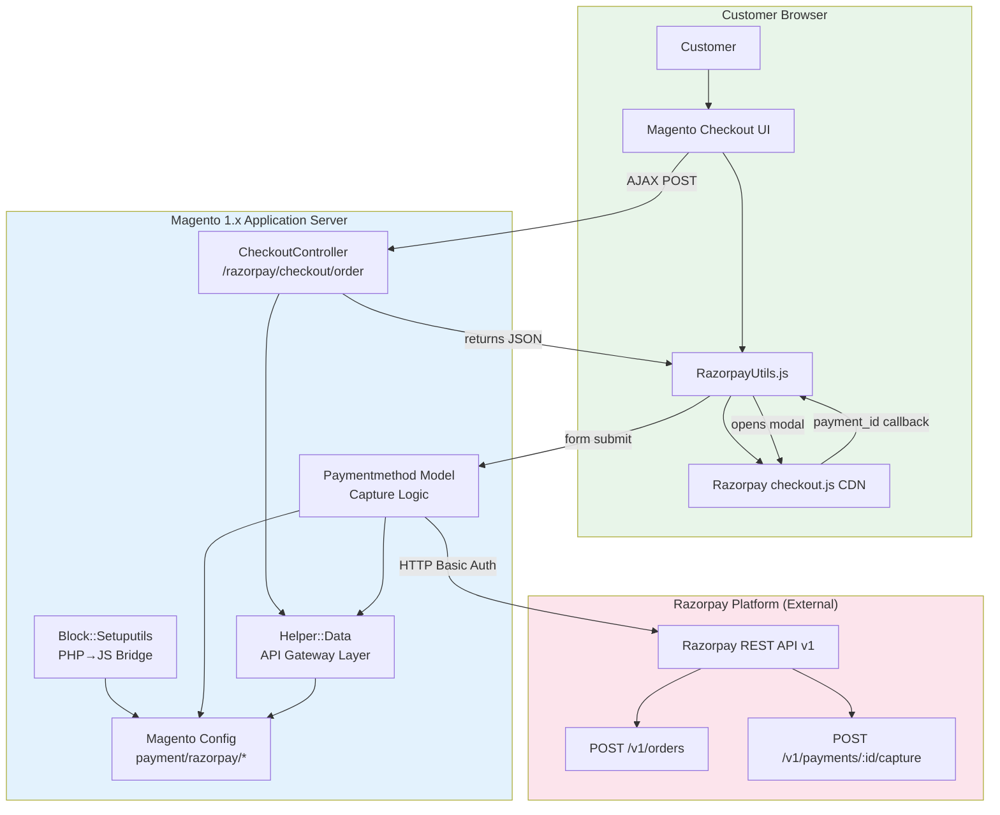
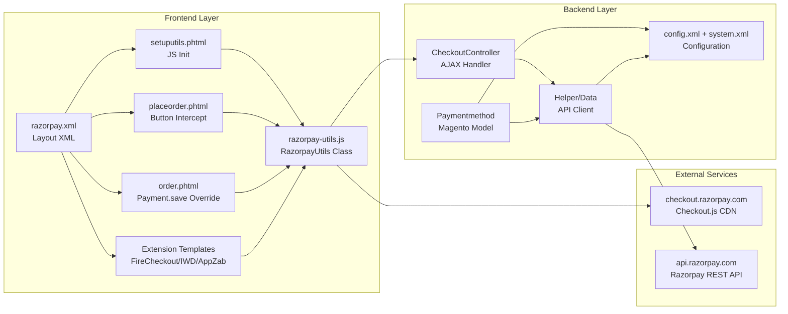
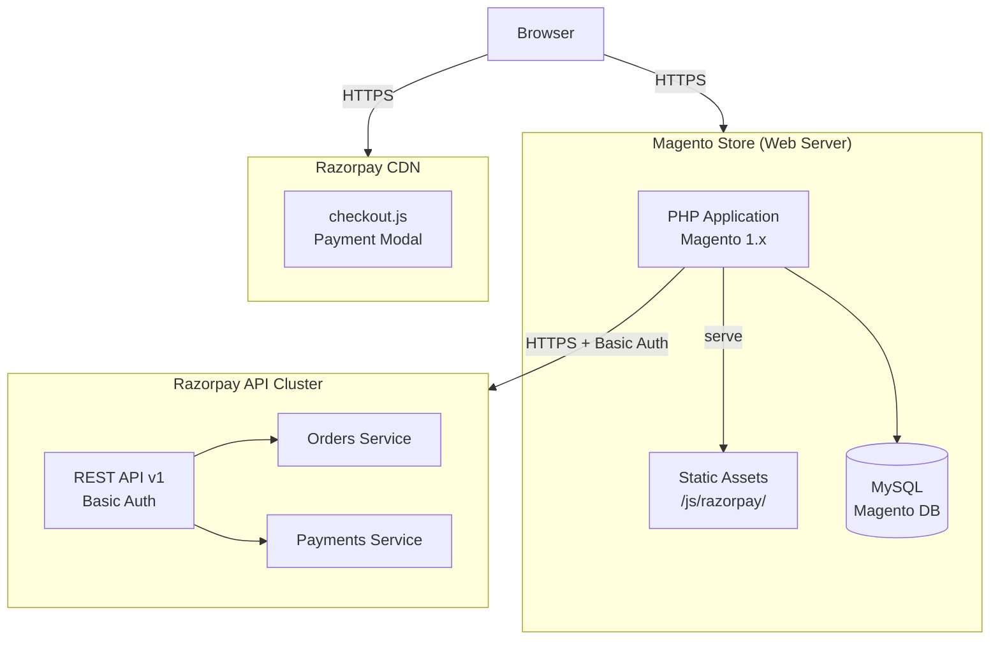
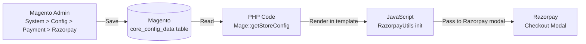
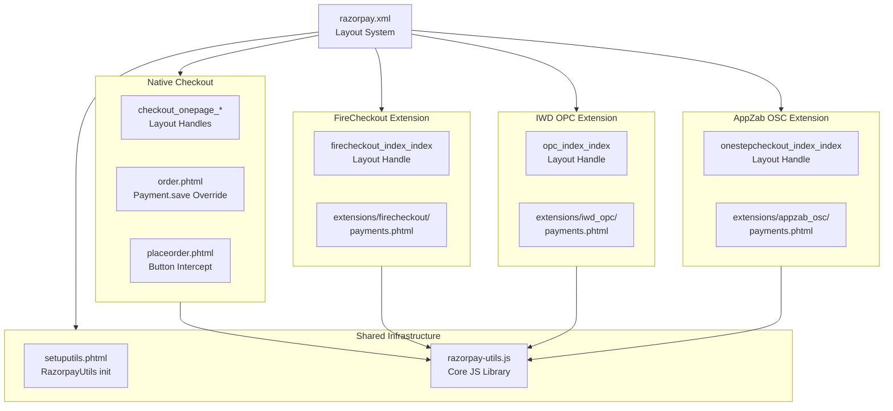
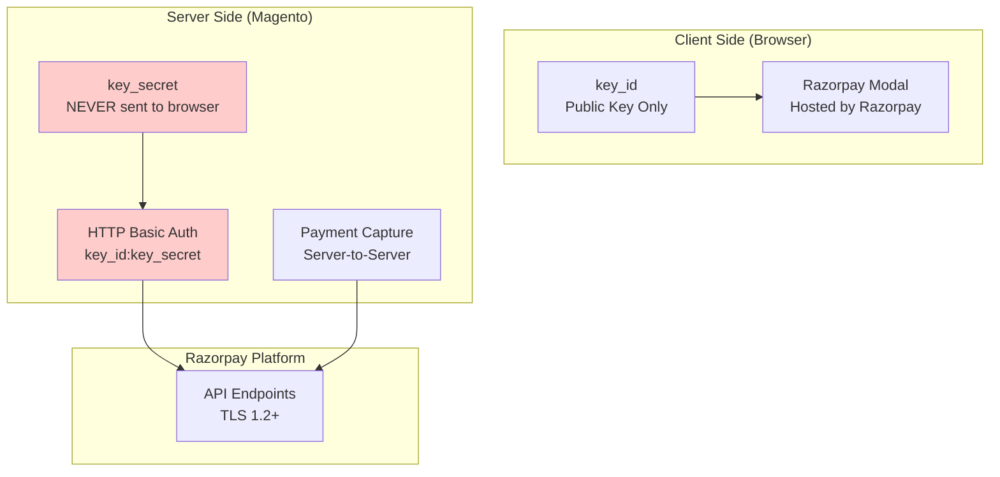
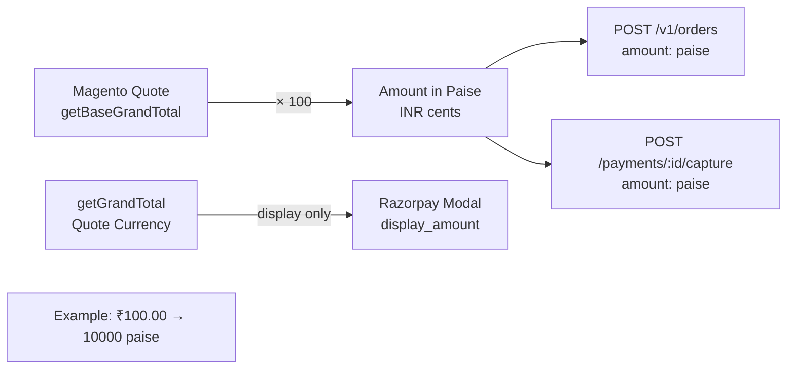
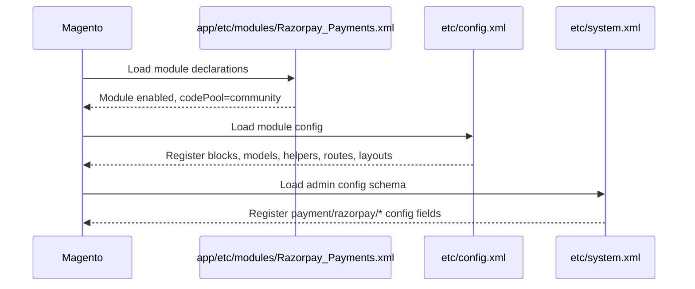

# High-Level Design (HLD) — Razorpay Magento Extension

## 1. System Overview

The Razorpay Magento extension is a **payment gateway integration** that bridges Magento 1.x's checkout system with Razorpay's payment processing platform. It operates as a classic Magento Community module following the `Razorpay_Payments` namespace.

---

## 2. HLD Architecture Diagram

---

## 3. Component Interaction Overview

---

## 4. Deployment Architecture

---

## 5. Configuration Flow

---

## 6. Checkout Extension Compatibility Architecture

---

## 7. Security Architecture

**Security invariants:**
- `key_secret` is only in Magento's `core_config_data` table (encrypted at rest in production)
- Only `key_id` is exposed to browser JavaScript
- Payment capture is always server-side (PHP → Razorpay API)
- The `razorpay_payment_id` from browser is validated by Razorpay during server-side capture

---

## 8. Data Flow — Amount Handling

---

## 9. Module Registration Flow

