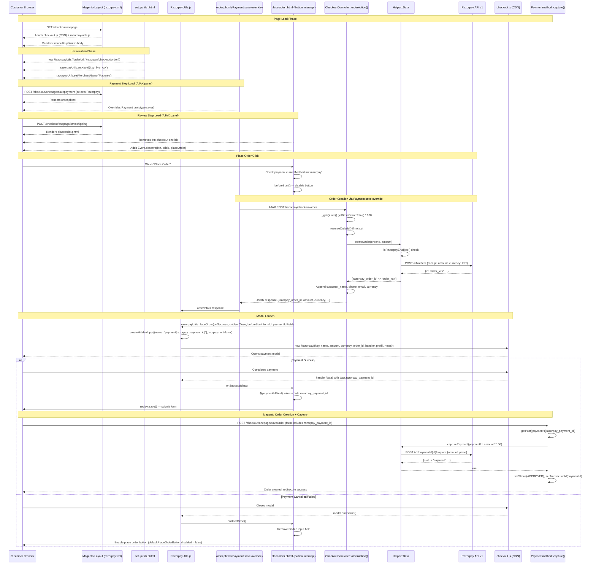
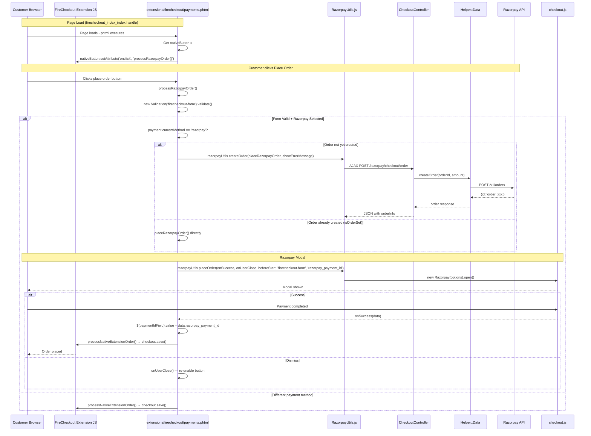
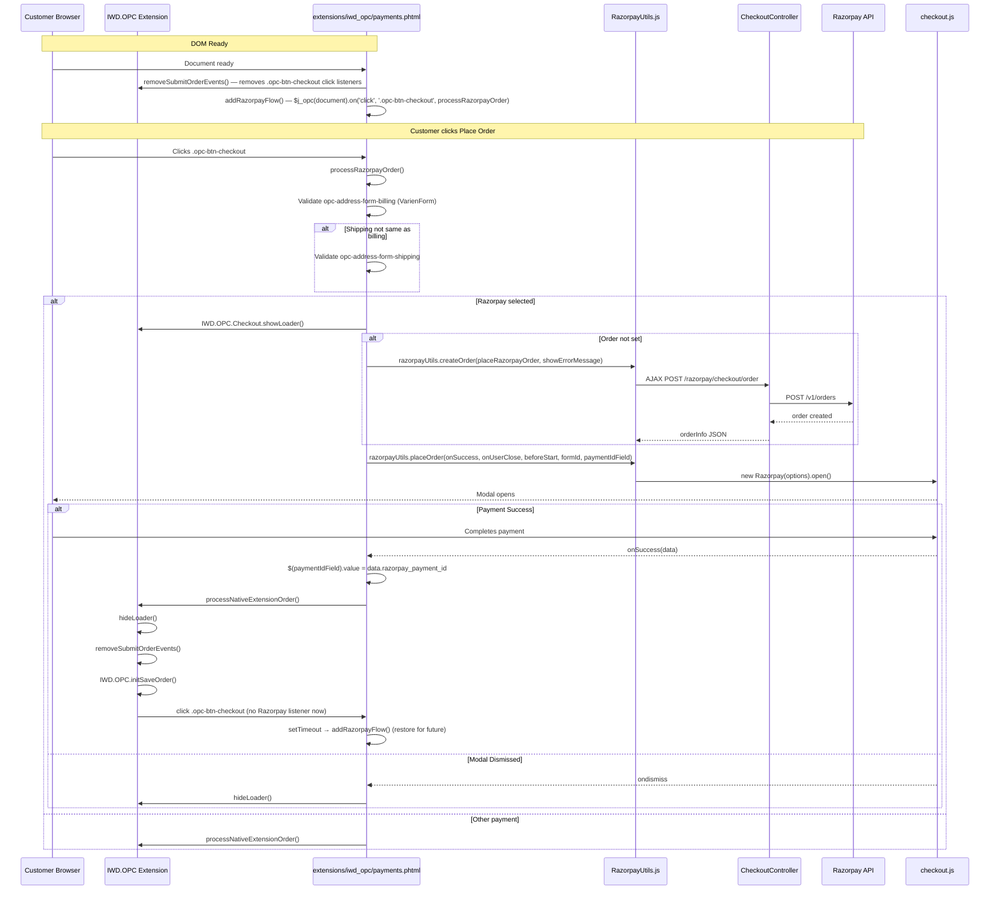
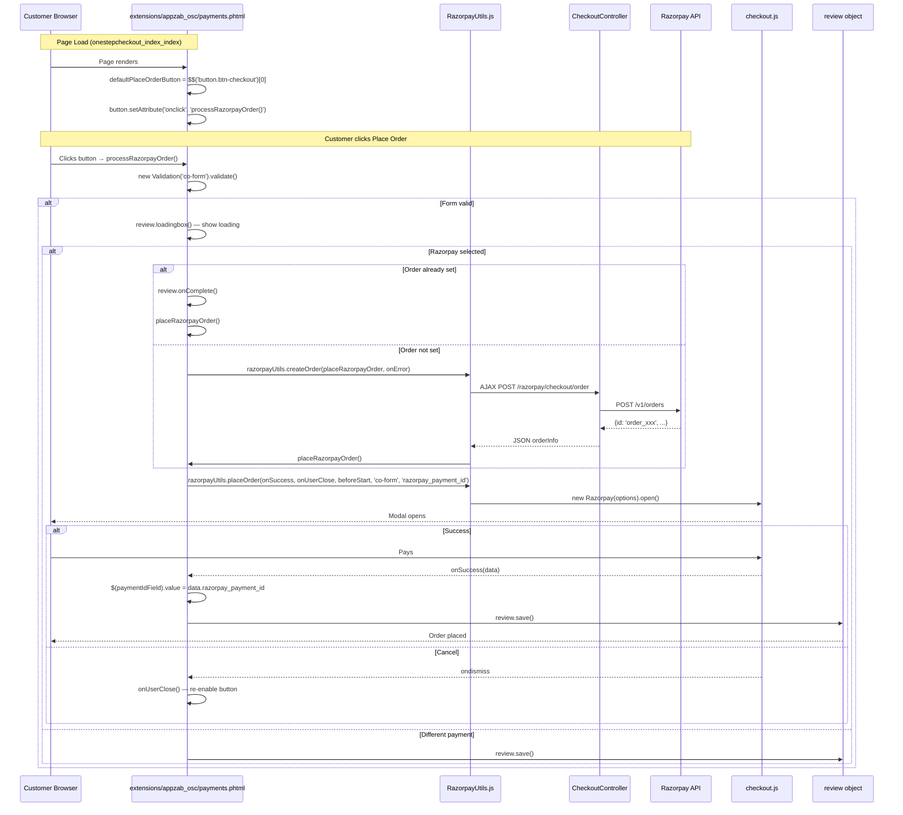
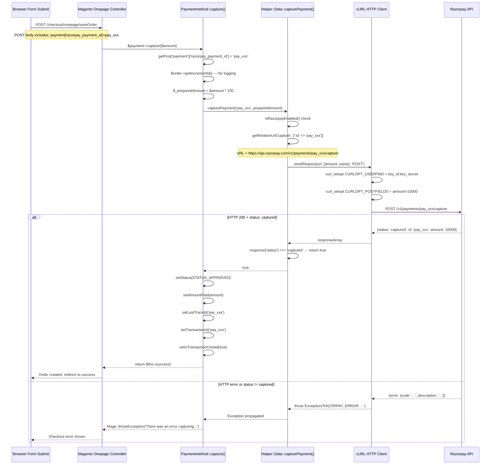
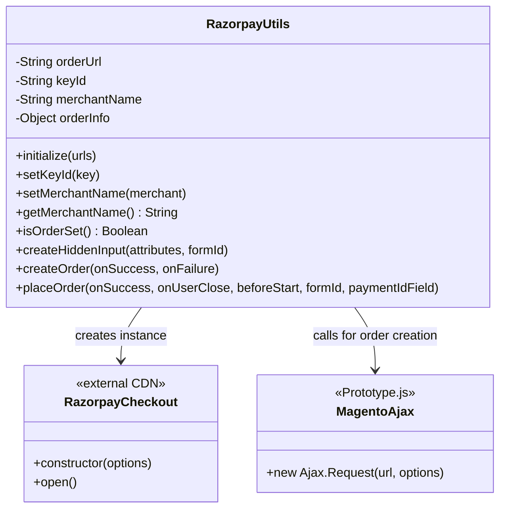
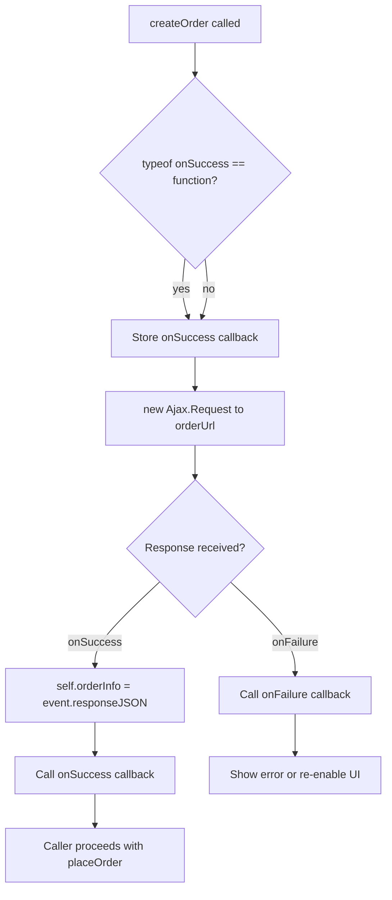
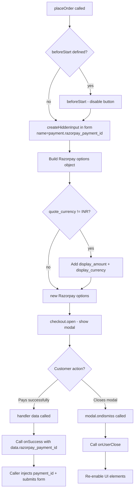
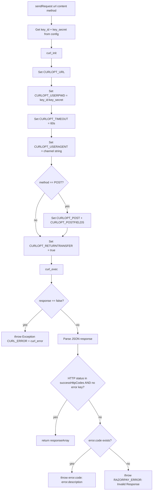

# Low-Level Design (LLD) — Razorpay Magento Extension

## 1. Native Onepage Checkout — Full Sequence Diagram

---

## 2. FireCheckout Extension — Sequence Diagram

---

## 3. IWD OPC Extension — Sequence Diagram

---

## 4. AppZab OSC Extension — Sequence Diagram

---

## 5. Payment Capture — Detailed LLD

---

## 6. JS RazorpayUtils Class — LLD

---

## 7. createOrder() Flow — Detailed

---

## 8. placeOrder() Flow — Detailed

---

## 9. Helper::sendRequest() — Detailed Flow

